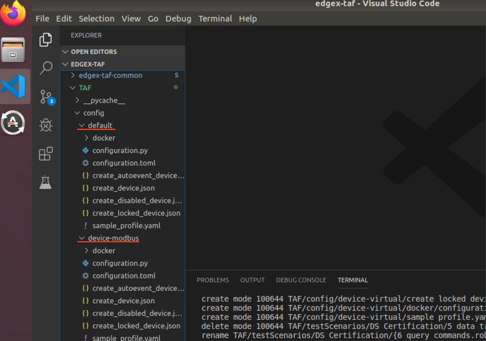
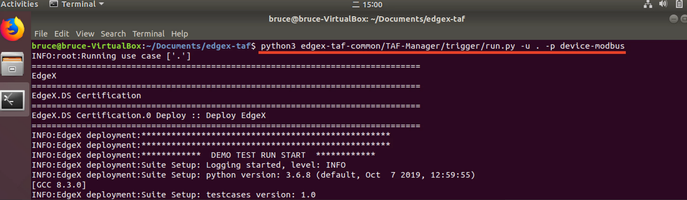
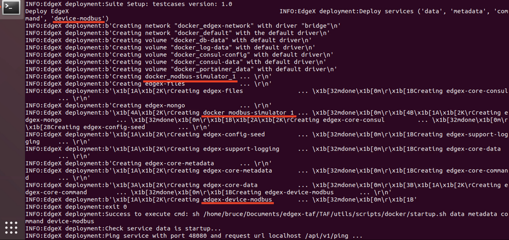
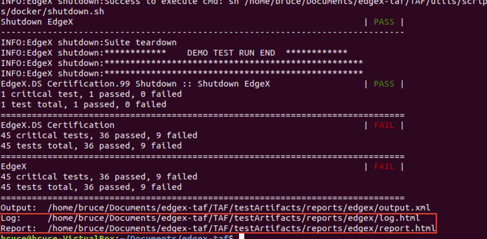
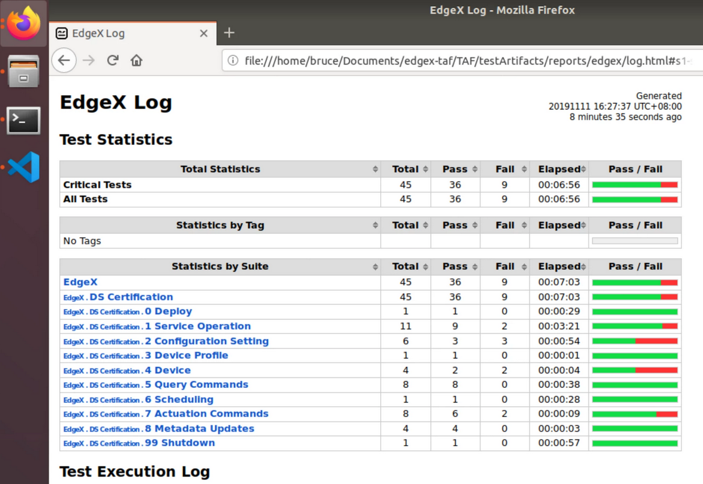

##################################
Self-assessment of Device Services
##################################

The self-assessment process allows an organization to conduct their own evaluation using EdgeX-provided tools to confirm that basic technical requirements are met. This assessment will be a prerequisite for submitting a component to EdgeX for formal certification.

For a more detailed description of the self-assessment plan, refer to `<https://wiki.edgexfoundry.org/display/FA/Certification+Plan+Document#CertificationPlanDocument-Self-Assessment>`_.

Environment
===========

This document was written and tested with the following tools:

* Ubuntu Desktop 18.04
* Python 3.6.8
* Docker 19.03.4

Quick Start with Virtual Device Service
=======================================

Clone the edgex-taf Project
---------------------------

::

    git clone git@github.com:edgexfoundry/device-service-certification.git

Fetch git Submodule
-------------------

The edgex-taf project includes an empty edgex-taf-common submodule. You must run the following commands to initialize your local configuration file and fetch all the data from that project:

::

    cd device-service-certification
    git submodule update --init --recursive

Install Pre-requisites
----------------------

::

    cd edgex-taf
    sudo ./updateme.sh

Run the Tests
-------------

::

    python3 ./edgex-taf-common/TAF-Manager/trigger/run.py -u '*'

Open the Test Results
---------------------

Open the test reports in the browser. For example, to open the **Virtual Device Service** certification report, enter the following URL in the browser::

    path/to/edgex-taf/TAF/testArtifacts/reports/edgex/report.html

Certification for Modbus Device Service
=======================================

In this section, we add the Modbus Device Service to the edgex-taf project and run the certification testing.

Add Device Service Profile
---------------------------

The default profile provided the certification settings for the Virtual Device Service, so we must add a profile for the Modbus Device Service.

As shown in the following screenshot, we copy the default folder and rename it to device-modbus:

Setup the configuration.py File
-------------------------------

The Modbus Device Service is known as *device-modbus* in the docker-compose file and the exported port is ``49991``,  so we need to change the ``DEVICE_SERVICE_NAME`` and ``DEVICE_SERVICE_PORT`` accordingly, as illustrated below:

  .. image:: images/certification-config-py.png
      :scale: 40%
      :alt: Setup the configuration.py File

The Modbus Device Service does not support INT8 and UINT8, so we remove the unsupported data types, as illustrated below:

  .. image:: images/certification-remove-datatypes.png
      :scale: 40%
      :alt: Remove Data Types

Provide the Device Entity in the device.jsonFile
------------------------------------------------

We must provide the device entity used for the certification testing, as illustrated below:

  .. image:: images/certification-provide-entity.png
      :scale: 50%
      :alt: Provide Device Entity

The *%Variable%* is used for test script to replace with the test data.

Provide the configuration.toml File
-----------------------------------

We must provide two configuration.toml with the same content, which was used to deploy the Device Service, as illustrated below:

  .. image:: images/certification-config-toml.png
      :scale: 40%
      :alt: Provide Device Entity

We also need to change the ``ProfilesDir`` value to ``"/custom-config"``, as illustrated below:

  .. image:: images/certification-profilesdir.png
      :scale: 40%
      :alt: Update ProfilesDir

Setup the sample_profile.yaml
-----------------------------

For the Modbus Device Service, we must **remove the unsupported data types** and **provide the specified attributes**, as illustrated below:

  .. image:: images/certification-YAML.png
      :scale: 50%
      :alt: Update sample_profile.yaml

Add the Modbus Device Service and the Modbus Simulator to the docker-compose File
=================================================================================

In this document, we deploy all services using **docker**, so we must **add the docker images to the docker-compose file**, as illustrated below:

  .. image:: images/certification-docker-compose.png
      :scale: 50%
      :alt: Update docker-compose

You will also notice in the illustration above that we added a **volume** to **mount the predefined configuration**, which we mentioned in the *Provide the configuration.toml file* section above, and modify the **entrypoint** to accept different parameters.

Run the Tests
=============

Run the tests using the following command::

    python3 edgex-taf-common/TAF-Manager/trigger/run.py -u '*' -p device-virtual

You can see the test script deploy the **device-modbus** and **modbus-simulator**, as illustrated below:

|

|

|

After testing, we can open the report using the file path given in the terminal, as illustrated below:

